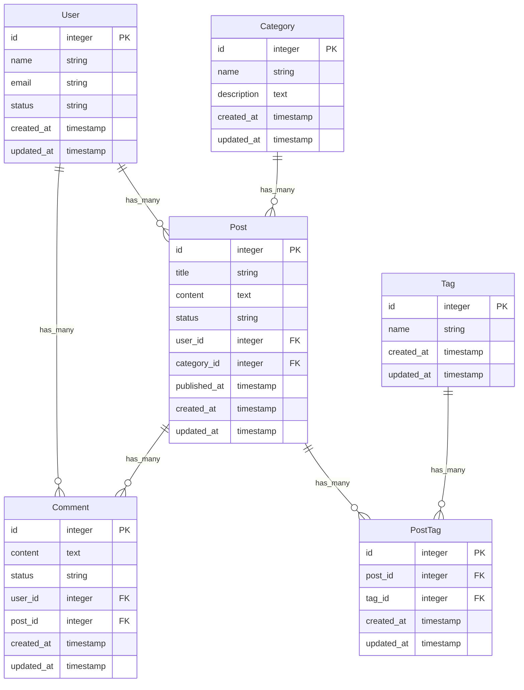

# docs/database_schema.md

```mermaid
erDiagram
    User {
        id integer PK
        name string
        email string
        status string
        created_at timestamp
        updated_at timestamp
    }
    
    Category {
        id integer PK
        name string
        description text
        created_at timestamp
        updated_at timestamp
    }
    
    Post {
        id integer PK
        title string
        content text
        status string
        user_id integer FK
        category_id integer FK
        published_at timestamp
        created_at timestamp
        updated_at timestamp
    }
    
    Comment {
        id integer PK
        content text
        status string
        user_id integer FK
        post_id integer FK
        created_at timestamp
        updated_at timestamp
    }
    
    Tag {
        id integer PK
        name string
        created_at timestamp
        updated_at timestamp
    }
    
    PostTag {
        id integer PK
        post_id integer FK
        tag_id integer FK
        created_at timestamp
        updated_at timestamp
    }
    
    User ||--o{ Post : "has_many"
    User ||--o{ Comment : "has_many"
    Category ||--o{ Post : "has_many"
    Post ||--o{ Comment : "has_many"
    Post ||--o{ PostTag : "has_many"
    Tag ||--o{ PostTag : "has_many"
```
